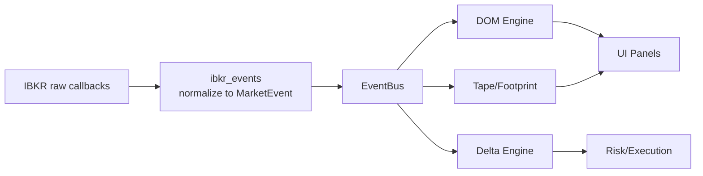
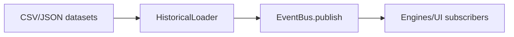

# Architecture

Event-driven data plane centered on a normalized `MarketEvent` contract and a lightweight `EventBus` dispatcher.

## Event-driven model
- Providers (IBKR, historical replay, future dxFeed) emit raw callbacks.
- Normalizers convert raw payloads to `MarketEvent`.
- EventBus routes events by `event_type` to subscribed engines/UI/adapters.
- Engines (DOM, Delta, Tape, Footprint, Patterns) transform and enrich.
- UI and Execution layers subscribe to enriched events for visualization and routing.

## MarketEvent lifecycle
1. **Ingest**: Provider callback arrives (tick-by-tick, DOM, trade, L1, or replay).
2. **Normalize**: `ibkr_events` builds a `MarketEvent` with consistent fields.
3. **Publish**: Connector calls `EventBus.publish`.
4. **Dispatch**: Bus worker fans out to subscribers for that `event_type`.
5. **Consume**: Engines update state; UI renders; execution/risk engines react.
6. **Persist (future)**: Events and engine states stored for replay/backtesting.

### Roles by module
- `core/event_bus.py`: Thread-safe dispatcher with worker thread and graceful stop.
- `models/market_event.py`: Canonical event schema with aliases (`event_type`/`type`, `timestamp`/`ts`).
- `ibkr/ibkr_connector.py`: Thin IBAPI wrapper that subscribes to tick-by-tick, DOM, fallback L1, and publishes normalized events.
- `ibkr/ibkr_events.py`: Pure functions that map IB raw callbacks to `MarketEvent` (tick, trade, dom_delta, dom_snapshot).
- `providers/historical_loader.py`: Loads CSV/JSON historical data and replays as live events.

### Separation of concerns
- **Providers**: Connectivity, subscriptions, raw callback handling (IBKR, dxFeed, replay).
- **Normalization**: Transform raw provider payloads into `MarketEvent`.
- **Core**: EventBus transport and lifecycle.
- **Engines**: State, aggregation, analytics (DOM, Delta, Tape, Footprint, Patterns).
- **UI**: Read-only subscribers (PySide6 panels).
- **Execution/Risk**: Order routing and safeguards consuming engine outputs.

## Diagrams

### Event flow: IBKR -> EventBus -> Engines


### Replay flow: HistoricalLoader -> EventBus -> Engines


### High-level system diagram
```mermaid
flowchart LR
    subgraph Providers
        IB[IBKR]
        DX[dxFeed]
        Hist[Historical Replay]
    end
    subgraph Core
        Norm[Normalization (MarketEvent)]
        EB[EventBus]
    end
    subgraph Engines
        DOM[DOM Engine]
        DELTA[Delta Engine]
        TAPE[Tape/Footprint]
        PAT[Patterns/ML]
    end
    subgraph Execution
        MT5[MT5 Adapter]
        IBX[IBKR Orders]
        RISK[Risk Engine]
    end
    Providers --> Norm --> EB --> Engines --> Execution
    EB --> UI[UI Panels]
```
