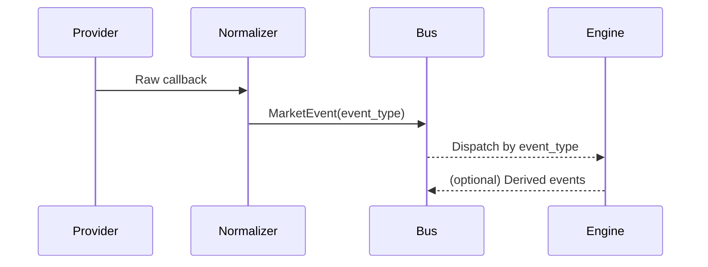
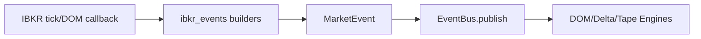
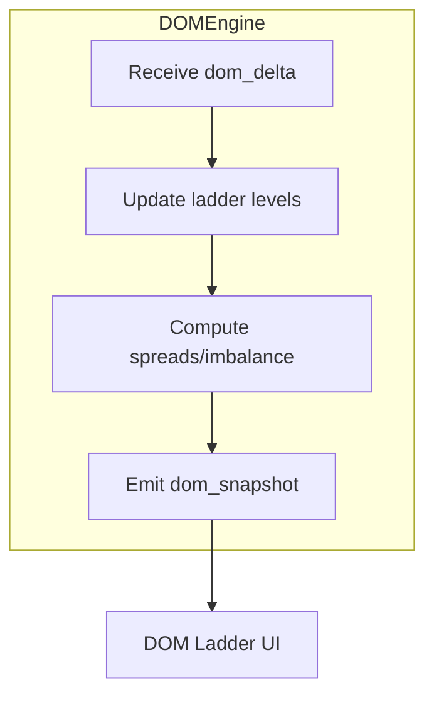
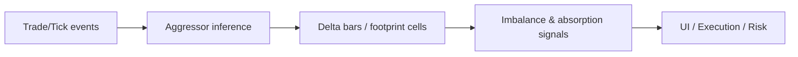
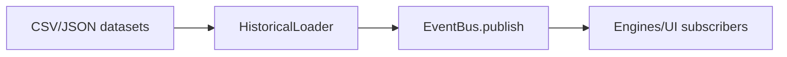

# Diagrams

## EventBus flow


## MarketEvent transformation pipeline (IBKR)


## Provider -> Engine -> UI overview
```mermaid
flowchart LR
    Providers --> Bus[EventBus]
    Bus --> Engines[Engines (DOM/Delta/Tape/Footprint)]
    Engines --> UI[UI Panels]
    Engines --> Exec[Execution/Risk]
```

## DOM Engine processing
```mermaid
flowchart LR
    Delta[DOM deltas (MarketEvent.dom_delta)] --> State[DOM Engine state store]
    State --> Ladder[DOM ladder snapshot]
    Ladder --> Outputs[UI panels / replay snapshots]
```

## DOM Engine placeholder (future)


## Delta Engine processing


## Replay engine pipeline


## Top-level system
```mermaid
flowchart LR
    subgraph Providers
        IB[IBKR]
        DX[dxFeed]
        Hist[Historical Replay]
    end
    subgraph Core
        Norm[Normalization (MarketEvent)]
        EB[EventBus]
    end
    subgraph Engines
        DOM[DOM Engine]
        DELTA[Delta Engine]
        TAPE[Tape/Footprint]
        PAT[Patterns/ML]
    end
    subgraph Execution
        MT5[MT5 Adapter]
        IBX[IBKR Orders]
        RISK[Risk Engine]
    end
    Providers --> Norm --> EB --> Engines --> Execution
    EB --> UI[UI Panels]
```
