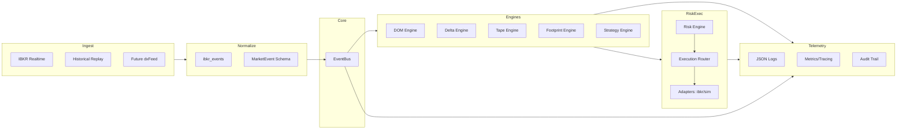
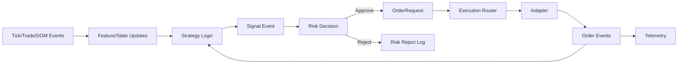
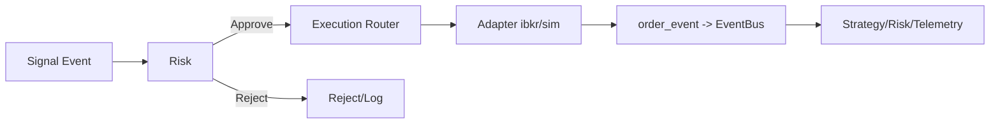
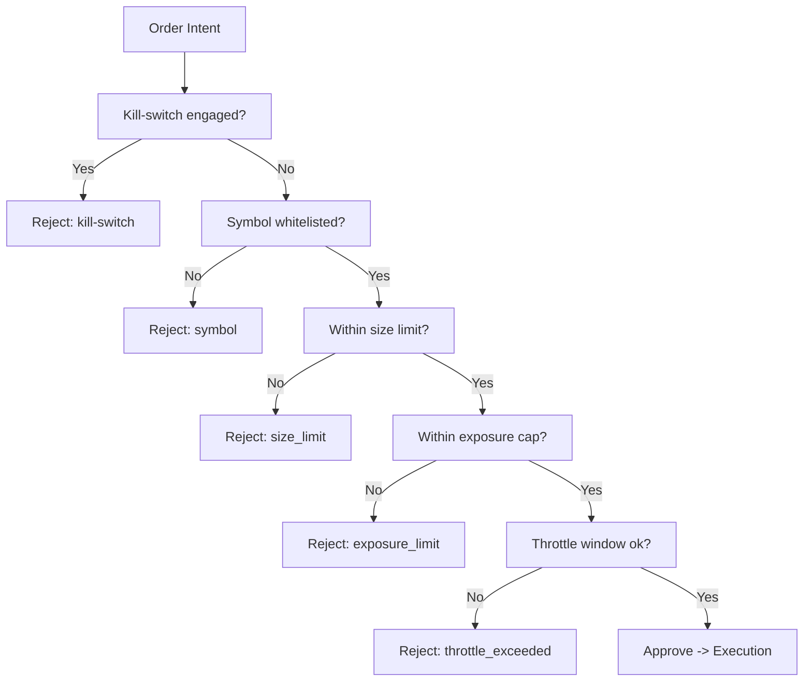

# DIAGRAMS.md — Diagramas Integrados

## Arquitetura Geral


## Data Pipeline
```mermaid
flowchart LR
    IB[IBKR API] --> Raw[Raw callbacks]
    Replay[CSV/JSON Replay] --> Raw
    Raw --> Norm[Normalization (ibkr_events)]
    Norm --> ME[MarketEvent]
    ME --> Bus[EventBus.publish]
    Bus --> Engines[Engines State]
    Engines --> Strat[Strategy]
    Strat --> Risk[Risk Engine]
    Risk --> Exec[Execution Router]
    Exec --> Adapters[Adapters ibkr/sim]
```

## Signal Flow


## Execution Flow


## Risk Decision Tree


## Failure & Recovery
```mermaid
flowchart LR
    Fault[Fault Detected] --> Classify[Classify: Feed | Exec | Risk | Infra]
    Classify --> FeedStale[Feed Stale] --> Action1[Fallback L1 / Alert / Halt strategies]
    Classify --> ExecErr[Execution Error] --> Action2[Retry/Cancel/Route sim]
    Classify --> RiskTrip[Risk Trip] --> Action3[Engage Kill-switch + Cancel]
    Classify --> Infra[Infra/Process] --> Action4[Restart worker / Replay]
    Action1 --> Telemetry[Log/Audit/Metrics]
    Action2 --> Telemetry
    Action3 --> Telemetry
    Action4 --> Telemetry
```
