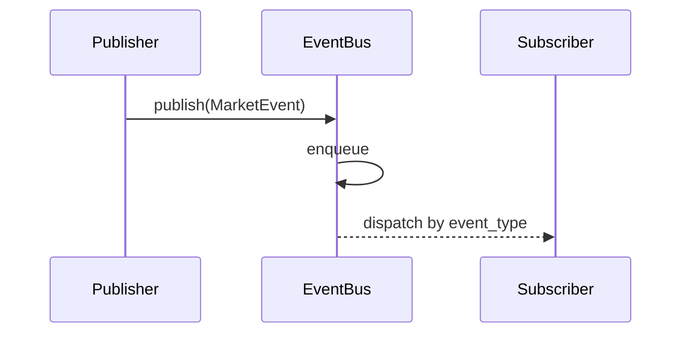

# PHASE_I.md — Bots Institucionais – Edição II — Núcleo de Eventos e Normalização

## 1) Propósito e Escopo
Estabelecer o alicerce institucional para ingestão e distribuição de dados de mercado: um contrato canônico de evento (`MarketEvent`) e um barramento de eventos thread-safe (`EventBus`). Garantir consistência de schema, previsibilidade de entrega e segurança de concorrência para sustentar fases posteriores (normalização avançada, engines de estado, estratégia, risco e execução).

## 2) Arquitetura de Referência (Fase I)
- **Contrato de Dados**: `MarketEvent` imutável (Pydantic v2), com aliases para compatibilidade (`event_type`/`type`, `timestamp`/`ts`), extensível via `payload`.
- **Transporte**: `EventBus` com fila `queue.Queue`, worker dedicado, subscrição por `event_type`, suporte a wildcard `*`, parada segura.
- **Ingestão Inicial**: conector IBKR mínimo (tick/trade) para provar conectividade e normalização básica.
- **Testabilidade**: suíte pytest inicial garantindo que o bus despacha e o evento é imutável/alias-friendly.
- **Estilo Institucional**: tipagem total, logging em vez de `print`, separação clara de domínios (`core/`, `models/`, `ibkr/`).

### Diagrama — Fluxo Fundamental
```mermaid
flowchart LR
    Provider[IBKR Provider (mínimo)] --> Normalize[Normalize -> MarketEvent]
    Normalize --> Bus[EventBus]
    Bus --> Consumers[Engines/Consumers]
```

## 3) Contrato `MarketEvent`
- Campos obrigatórios: `event_type`, `timestamp` (UTC), `source`, `symbol`, `payload`.
- Campos opcionais de correlação: `trace_id`, `span_id`.
- Aliases: `type`, `ts`.
- Config: `frozen=True`, `extra="ignore"` (forward compatibility), `populate_by_name=True`.
- Objetivo: padronizar mensagens entre provedores, normalizadores, engines e camadas superiores.

## 4) Barramento de Eventos (`EventBus`)
- `subscribe(event_type|iterable, callback)`: registra callbacks por tipo; wildcard `*` recebe tudo.
- `publish(event: MarketEvent)`: enqueue não bloqueante.
- Worker thread: consome fila, despacha callbacks, captura exceções com logging.
- `stop(timeout)`: sinaliza parada, drena fila com sentinela, encerra worker.

### Diagrama — EventBus Interno


## 5) Ingestão IBKR (Baseline)
- Conector mínimo (Fase I) para tick/trade: chama normalizadores e publica no `EventBus`.
- Sem DOM nem fallback nesta fase; foco em provar a cadeia ingestão→normalização→bus.

## 6) Qualidade, Testes e Estilo
- Testes pytest:
  - `EventBus` despacha evento publicado.
  - `MarketEvent` aceita aliases e é imutável.
- Guia de estilo (`STYLEGUIDE.md`): Python 3.11+, tipagem obrigatória, logging estruturado.

## 7) Operação (Fase I)
- Dependências: `pydantic`, `ibapi`.
- Execução de testes: `python -m pytest`.
- Smoke IBKR: iniciar TWS/IB Gateway (paper), rodar script mínimo de conexão.

## 8) Checklist de Conclusão (Fase I)
- [x] `MarketEvent` canônico, imutável, alias-friendly.
- [x] `EventBus` thread-safe com publish/subscribe/stop.
- [x] Conector IBKR mínimo publicando eventos normalizados.
- [x] Testes básicos de bus e evento.
- [x] Documentos fundacionais (README inicial, STYLEGUIDE, CONTRIBUTING, CHANGELOG v0.1.0).
