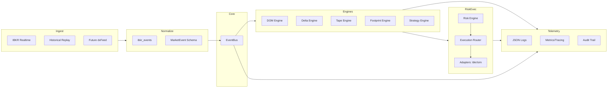
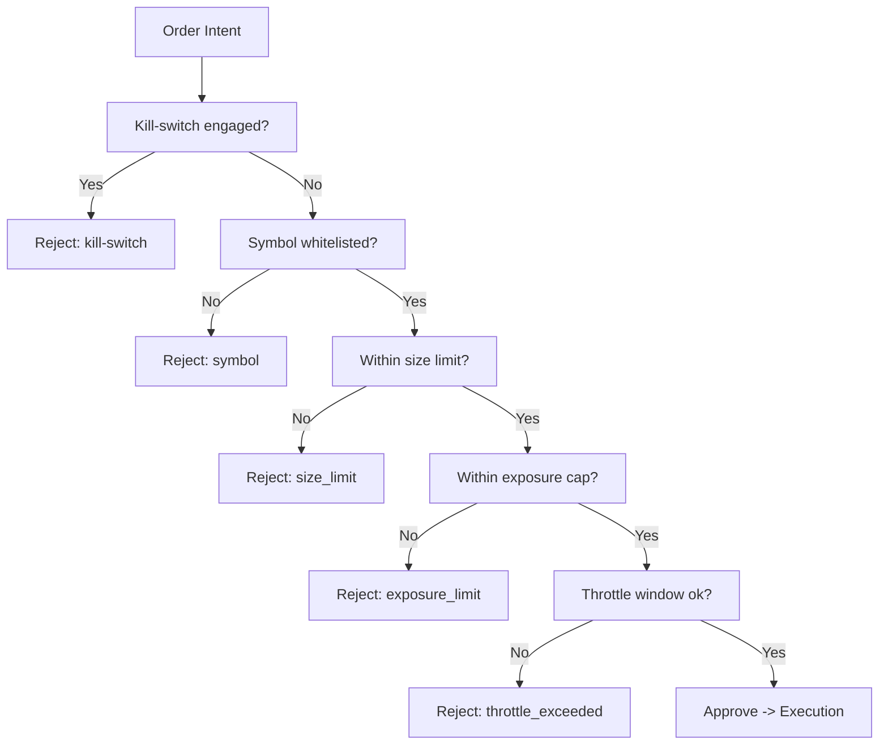
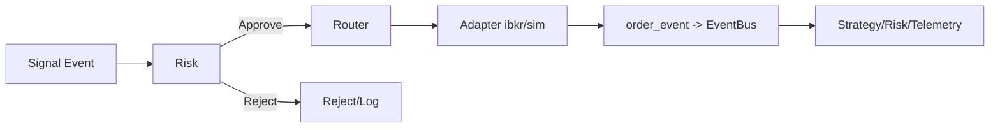

# PHASE_III.md — Bots Institucionais – Edição II — Da Leitura de Tape à Automação Profissional

## 1) Introdução e Escopo
A Fase III converte o pipeline de dados em um ecossistema de automação institucional completo: engines de estado (DOM/Delta/Tape/Footprint), estratégia event-driven, risco pré-trade, roteamento de ordens (sim/IBKR), telemetria estruturada, configuração versionada, governança e operação (sim/live/replay). A arquitetura permanece orientada a eventos, com contratos estáveis e separação rigorosa de responsabilidades.

## 2) Arquitetura do Sistema
- **Ingestão**: IBKR (tick-by-tick + DOM + fallback L1), Historical Replay.
- **Normalização**: `ibkr_events` → `MarketEvent` (imutável, aliases).
- **Transporte**: `EventBus` thread-safe, wildcard, shutdown seguro.
- **Engines de Estado**: DOM, Delta, Tape, Footprint.
- **Estratégia**: micro-price momentum de exemplo; emissão de `signal`.
- **Risco**: whitelist, tamanho, exposição, throttle, kill-switch.
- **Execução**: Router + adaptadores (sim, stub IBKR); eventos de ordem.
- **Telemetria**: JSON logs, métricas/tracing in-memory, audit line.
- **Configuração**: YAML base, perfis (dev/paper/prod), overrides por env.
- **Governança/Segurança**: Segredos, papéis, incidentes, kill-switch.
- **Operação**: modos sim/live/replay, runbook, recuperação.

### Diagrama — Arquitetura Geral


## 3) Market Data Engine (Realtime + Normalização + Replay)
- **IBKR**: subscrição a `tickByTickBidAsk`, `tickByTickAllLast`, DOM `updateMktDepthL2`, fallback L1 `tickPrice/tickSize`.
- **Normalização**: Pydantic imutável para tick/trade/DOM delta/snapshot; computa mid/spread; agressor opcional.
- **Replay**: `HistoricalLoader` (CSV/JSON), ordena timestamps, `replay(speed, on_event)`.
- **Contrato**: `MarketEvent` com `event_type`, `timestamp` UTC, `source`, `symbol`, `payload`, `trace_id`, `span_id`; aliases `type`, `ts`.

### Diagrama — Data Pipeline
```mermaid
flowchart LR
    IB[IBKR API] --> Raw[Raw callbacks]
    Replay[CSV/JSON Replay] --> Raw
    Raw --> Norm[Normalization (ibkr_events)]
    Norm --> ME[MarketEvent]
    ME --> Bus[EventBus.publish]
    Bus --> Engines[Engines State]
    Engines --> Strat[Strategy]
    Strat --> Risk[Risk Engine]
    Risk --> Exec[Execution Router]
    Exec --> Adapters[Adapters ibkr/sim]
```

## 4) Strategy Engine
- **Base (`Strategy`)**: subscreve `tick/trade/dom_delta/dom_snapshot`; mantém `SymbolState`.
- **Exemplo (`MicroPriceMomentumStrategy`)**: delta de mid-price; emite `Signal` (direction, score, confidence) publicado como `MarketEvent` `signal`.
- **Features (`ml_features.py`)**: médias móveis simples (mean_5/mean_10/last).
- **Estado**: `SymbolState` (DOMState, DeltaBar, tape buffer).

## 5) Engines DOM / Delta / Tape / Footprint
- **DOM**: aplica `dom_delta` (insert/update/delete) em ladders bid/ask; snapshot `dom_snapshot`.
- **Delta**: agrega trades em barras delta (`buys/sells/volume/last_price`); `delta_bar` sob demanda.
- **Tape**: deque rolling de trades (ts, price, size, aggressor); snapshot `tape_snapshot`.
- **Footprint**: volume por preço/agressor (`buy/sell/unknown`); snapshot `footprint_snapshot`.
- Todos são síncronos, in-memory, acoplados ao `EventBus`.

## 6) Risk Engine (Pré-trade)
- **RiskEngine**: kill-switch, whitelist, limite de tamanho (`max_size`), limite de exposição (`max_exposure`), throttle por símbolo em 60s (`throttle_max`).
- Retorna `RiskDecision` (approved, reasons, limits); ajusta exposição ao aprovar.
- **Rules helper**: price collar conceitual (`within_price_collar`).
- **Kill-switch**: flag e `KillSwitch` para notificação de listeners.

### Diagrama — Árvore de Decisão de Risco


## 7) Execution Engine
- **ExecutionRouter**: recebe `OrderRequest`, envia ao adaptador, publica `order_event` (`MarketEvent`).
- **Adaptadores**:
  - `SimAdapter`: ACK imediato, fill probabilístico (default 100%), `order_event` (ack/fill/cancel).
  - `IBKRAdapter` (stub): converte para `Order` IBKR, envia via IB API, ACK local; callbacks publicam `order_event`.
- **Ordens**: `OrderRequest` (side/type/qty/price/tif/flags), `OrderEvent` (status, filled_qty, avg_price, reason, raw).

### Diagrama — Fluxo de Execução


## 8) Telemetry & Logging
- **Logging**: JSON (`ts`, `level`, `component`, `message`, `trace_id`, `span_id`, `symbol`, `order_id`, `signal_id`, `context`, `env`, `pid`).
- **Métricas/Tracing**: `MetricsSink` (counters/gauges), `TraceSpan` (duração/status), helper `traced_span`.
- **Audit**: `audit_log` linha JSON; integridade via hash-chaining em pipeline externo recomendado.

## 9) Configuração
- Base: `config/settings.yaml` (env, symbols, providers.ibkr, telemetry.log_level, execution.mode/slippage, risk limits, replay speed).
- Perfis: `config/profiles/{dev,paper,prod}.yaml` via `PROFILE`.
- Overrides: env vars (IBKR_HOST/PORT/CLIENT_ID, LOG_LEVEL, etc).
- Loader: `core/config.py` (mescla base+perfil+env, retorna `Settings` imutável).

## 10) Governança & Segurança
- Segredos fora do VCS; `secrets.example.yaml` como modelo.
- Papéis: Dev (sim/replay), Operador (paper/prod), Auditor (logs/audit).
- Menor privilégio; kill-switch para incidentes; cancelamentos e auditoria.

## 11) Falhas & Recuperação
- Feed: fallback L1; staleness monitor conceitual.
- Execução: kill-switch, cancels; reinício de conector em falha de transporte.
- Replay: reiniciar loader; determinismo garantido por ordering.
- Shutdown: `EventBus.stop()` drena fila; conector IBKR encerra thread; adaptador sim é síncrono.

### Diagrama — Falha e Recuperação
```mermaid
flowchart LR
    Fault[Fault Detected] --> Classify[Classify: Feed | Exec | Risk | Infra]
    Classify --> FeedStale[Feed Stale] --> Action1[Fallback L1 / Alert / Halt strategies]
    Classify --> ExecErr[Execution Error] --> Action2[Retry/Cancel/Route sim]
    Classify --> RiskTrip[Risk Trip] --> Action3[Engage Kill-switch + Cancel]
    Classify --> Infra[Infra/Process] --> Action4[Restart worker / Replay]
    Action1 --> Telemetry[Log/Audit/Metrics]
    Action2 --> Telemetry
    Action3 --> Telemetry
    Action4 --> Telemetry
```

## 12) Versionamento & Releases (v0.3.x)
- Semver por fase: v0.3.x = Fase III.
- Compatibilidade: `MarketEvent` estável; mudanças aditivas.
- Changelog: entrada 0.3.0 com entregas de engines, risco, execução, telemetria, config.
- Release checklist: pytest (sim/replay), smoke IBKR opcional (paper/live), atualização de perfis.

## 13) Operação (sim, live, replay)
- **SIM**: `python main.py --profile dev --mode sim`
- **LIVE IBKR**: `python main.py --profile prod --mode ibkr --symbol XAUUSD --host 127.0.0.1 --port 7497`
- **REPLAY**: `python run_replay.py --file data/events.json --speed 2.0`
- Kill-switch: flag em RiskEngine ou `KillSwitch.engage()`, cancelar ordens, retomar após auditoria.

## 14) Checklist de Conclusão
- [x] `MarketEvent` imutável com aliases e correlação opcional.
- [x] `EventBus` thread-safe com wildcard e shutdown seguro.
- [x] Normalização IBKR tick/trade/DOM + fallback L1.
- [x] Replay CSV/JSON com pacing.
- [x] Engines DOM/Delta/Tape/Footprint.
- [x] Estratégia event-driven emitindo sinais.
- [x] RiskEngine (whitelist, size, exposição, throttle, kill-switch).
- [x] Execution Router + adaptadores (sim, stub IBKR) com `order_event`.
- [x] Telemetria (JSON log, métricas/tracing, audit).
- [x] Config (YAML + perfis + overrides).
- [x] Operação sim/live/replay e runbook.
- [x] Documentação completa Phase III, ROADMAP/CHANGELOG atualizados.
