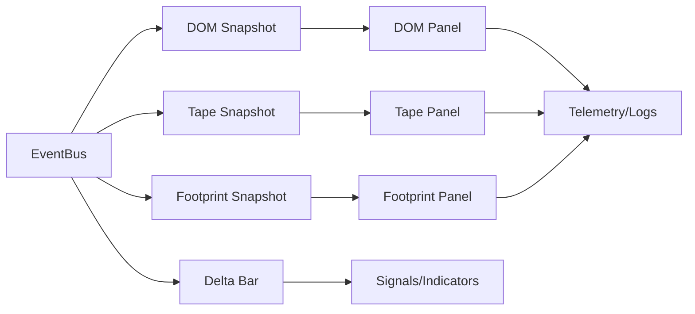

# PHASE_IV.md — Bots Institucionais – Edição II — UI Institucional e Observabilidade (Plano)

## 1) Escopo da Fase IV
Entregar camadas de visualização institucional (PySide6) para DOM ladder, Tape, Footprint e T&S, alimentadas pelo EventBus e compatíveis com replay. Garantir responsividade, throttling de refresh, e integração com telemetria para monitoramento da UI.

## 2) Objetivos
- UI desktop PySide6 com painéis DOM, Tape, Footprint e T&S.
- Subscrição direta ao `EventBus` com filtros por símbolo e tipo de evento.
- Renderização eficiente (throttling de updates, batch de eventos).
- Suporte a modos live e replay; consistência temporal (timestamp nos eventos).
- Integração com telemetria (logs estruturados, métricas de latência/render, tracing por painel).

## 3) Arquitetura de UI
- **Data plane**: EventBus entrega `dom_snapshot`, `tape_snapshot`, `footprint_snapshot`, `delta_bar`, `tick/trade`.
- **UI layer**: componentes PySide6; view-model para normalizar/filtrar dados; throttling por timer.
- **Config**: tema, símbolos, refresh rate, layout persistente.
- **Observabilidade**: logs de interação, métricas de FPS/refresh, tracing opcional para ações críticas.

### Diagrama — Integração UI

## 4) Planejamento Técnico
- **Camada de acesso**: cliente UI conecta a EventBus (injeção do bus ou cliente remoto futuro).
- **Throttling**: timer de repaint (e.g., 50–100 ms) para agregar múltiplos eventos em um render.
- **Estado UI**: view-model por painel com snapshot incremental.
- **Temas e layout**: configuração YAML/JSON para colunas, cores, hotkeys.
- **Testes**: smoke tests de rendering headless (Qt test), contratos de dados (Pydantic), replay assistido.

## 5) Dependências e Riscos
- Dependência de Qt/PySide6 (licenciamento e runtime).
- Performance de rendering em máquinas modestas.
- Sincronização com replay (pacing) e clocks.

## 6) Critérios de Conclusão (Fase IV)
- Painéis DOM, Tape, Footprint e T&S funcionais em sim/live/replay.
- Throttling configurável; nenhuma travada perceptível.
- Logs/métricas de UI habilitados.
- Tests smoke/headless cobrindo carregamento e subscrição.
- Documentação UI incluída no runbook.
