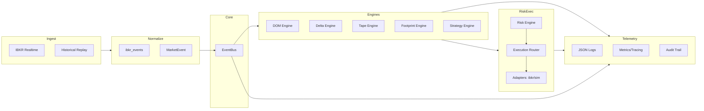
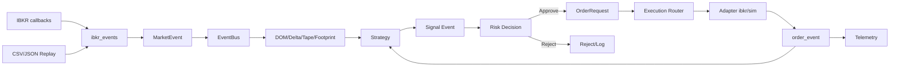

# BOTS INSTITUCIONAIS - EDICAO II (Fases I, II, III)

Plataforma institucional event-driven para leitura de tape e execução profissional sobre IBKR, construída em Python 3.x, com dados normalizados, engines de estado, estratégia, risco pré-trade, roteamento de ordens (sim/IBKR) e telemetria estruturada. Adequada a operações tipo JPMorgan/HSBC: separação de responsabilidades, observabilidade, governança e modos sim/live/replay.

## Arquitetura em um olhar

### Visão Geral


### Pipeline de Dados e Sinais


## Capacidades Principais
- EventBus thread-safe; `MarketEvent` imutável e alias-friendly.
- Market data: IBKR tick/DOM/fallback L1; replay CSV/JSON com pacing.
- Engines de estado: DOM, Delta/CVD, Tape, Footprint.
- Estratégia: event-driven; exemplo de micro-price momentum com emissão de sinais.
- Risco: whitelist, limites de tamanho/exposição, throttle, kill-switch.
- Execução: Router + adaptadores sim/IBKR; eventos de ordem no bus.
- Observabilidade: logs JSON, métricas/tracing helpers, audit trail.
- Configuração: YAML + perfis (dev/paper/prod) + overrides por ambiente.

## Estrutura do projeto
```
core/                # EventBus, config, logging, telemetry helpers
models/              # MarketEvent, Signal, Order, RiskDecision, State
ibkr/                # Connector, normalizers, order builders, health
providers/           # HistoricalLoader, replay_clock, dxfeed placeholder
engines/             # dom.py, delta.py, tape.py, footprint.py, strategy.py, ml_features.py
risk/                # engine.py, rules.py, kill_switch.py, limits.yaml
execution/           # router.py, adapters/ibkr.py, adapters/sim.py, order_book_router.py
telemetry/           # logger.py, metrics.py, tracing.py, audit.py
config/              # settings.yaml, secrets.example.yaml, profiles/{dev,paper,prod}.yaml
tests/               # pytest suite
main.py              # Live/sim entrypoint
run_replay.py        # Replay entrypoint
docs/                # PHASE_I/II/III/IV e demais guias/diagramas
```

## Instalação e Ambiente
```
python -m venv .venv
.\.venv\Scripts\activate    # PowerShell
pip install -r requirements.txt
```

## Modos de Operação
- **SIM**: `python main.py --profile dev --mode sim`
- **LIVE IBKR**: `python main.py --profile prod --mode ibkr --symbol XAUUSD --host 127.0.0.1 --port 7497`
- **REPLAY**: `python run_replay.py --file data/events.json --speed 2.0`

## Configuração
- Base: `config/settings.yaml`
- Perfis: `config/profiles/{dev,paper,prod}.yaml`
- Overrides: env vars (`PROFILE`, `IBKR_HOST/PORT/CLIENT_ID`, `LOG_LEVEL`, etc.)

## Observabilidade e Operação
- Logs JSON em stdout; ajustar `telemetry.log_level` ou `LOG_LEVEL`.
- Métricas/trace helpers in-memory; audit line via `telemetry/audit.py`.
- Kill-switch pronto para incidentes; cancelamento de ordens via adaptadores.
- Testes: `python -m pytest`

## Status do Projeto
- Fase I: núcleo (EventBus, MarketEvent) — concluída.
- Fase II: provedores/normalização/replay — concluída.
- Fase III: engines, estratégia, risco, execução, telemetria, config — concluída (v0.3.x).
- Próximas: UI (Fase IV), execução avançada (V), risco expandido (VI), feeds e ML avançados conforme `ADVANCED_ROADMAP.md`.
