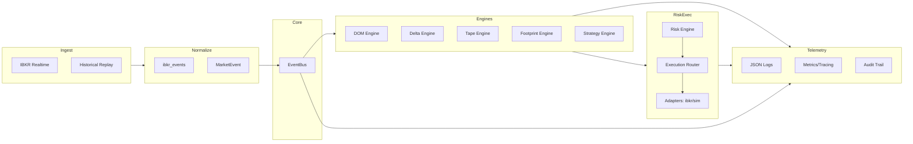
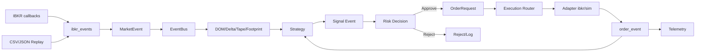

# BOTS INSTITUCIONAIS - EDICAO II (Fases I, II, III)

Plataforma institucional event-driven (Python 3.x + IBKR) com dados normalizados, engines de estado (DOM/Delta/Tape/Footprint), estratégia, risco pré-trade, roteamento de ordens (sim/IBKR), telemetria estruturada e operação em modos sim/live/replay.

## Arquitetura em um olhar (diagramas)

### Visão Geral


### Pipeline de Dados e Sinais


## O que há de novo na Fase III
- Engines DOM/Delta/Tape/Footprint em memória.
- Estratégia event-driven (micro-price momentum) emitindo `signal`.
- Risk Engine (whitelist, tamanho, exposição, throttle, kill-switch).
- Execution Router com adaptadores sim e stub IBKR; eventos de ordem no EventBus.
- Telemetria JSON, métricas/tracing helpers, audit line.
- Configuração por YAML + perfis (dev/paper/prod) + overrides por env.

## Arquitetura em linha
Providers (IBKR/Replay) → Normalizers (`ibkr_events`) → EventBus → Engines (DOM/Delta/Tape/Footprint) → Strategy → Risk → Execution Router → Adapters (sim/IBKR) → Order Events → Telemetry.

## Estrutura do projeto
```
core/                # EventBus, config, logging, telemetry helpers
models/              # MarketEvent, Signal, Order, RiskDecision, State
ibkr/                # Connector, normalizers, order builders, health
providers/           # HistoricalLoader, replay_clock, dxfeed placeholder
engines/             # dom.py, delta.py, tape.py, footprint.py, strategy.py, ml_features.py
risk/                # engine.py, rules.py, kill_switch.py, limits.yaml
execution/           # router.py, adapters/ibkr.py, adapters/sim.py, order_book_router.py
telemetry/           # logger.py, metrics.py, tracing.py, audit.py
config/              # settings.yaml, secrets.example.yaml, profiles/{dev,paper,prod}.yaml
tests/               # pytest suite
main.py              # Live entrypoint (sim/ibkr)
run_replay.py        # Replay entrypoint
docs: PHASE_I/II/III, CONFIG, TELEMETRY, GOVERNANCE_SECURITY, EXECUTION_PIPELINE, SIGNAL_FLOW, OPS_RUNBOOK, DIAGRAMS, ROADMAP, CHANGELOG
```

## Setup
```
python -m venv .venv
.\.venv\Scripts\activate    # PowerShell
pip install -r requirements.txt
```

## Testes
```
python -m pytest
```

## Modos de operação
- **SIM**: `python main.py --profile dev --mode sim`
- **LIVE IBKR**: `python main.py --profile prod --mode ibkr --symbol XAUUSD --host 127.0.0.1 --port 7497`
- **REPLAY**: `python run_replay.py --file data/events.json --speed 2.0`

## Status do projeto
- Fase I: núcleo (EventBus, MarketEvent) — concluída.
- Fase II: provedores/normalização/replay — concluída.
- Fase III: engines, estratégia, risco, execução, telemetria, config — concluída (v0.3.x).
- Próximas: UI (Fase IV), execução avançada (Fase V), risco expandido (Fase VI).
