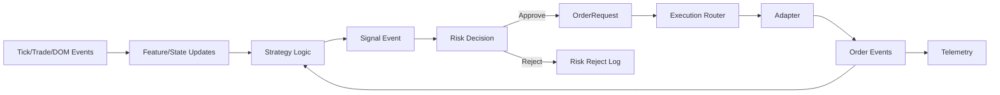

# SIGNAL_FLOW.md — Pipeline de Sinal

## Etapas
1) `MarketEvent` (`tick/trade/dom_delta/dom_snapshot`) chega pelo EventBus.
2) Engines atualizam estado (DOM ladder, delta bars, tape, footprint).
3) Estratégia computa features e emite `Signal` (`direction`, `score`, `confidence`).
4) `Signal` publicado como `MarketEvent`.
5) Risco converte `Signal` em `OrderRequest`, avalia e aprova/rejeita.
6) Execução envia ordem (sim/IBKR) e publica `order_event`.
7) Feedback (acks/fills) realimenta estratégia/telemetria.

## Integração de Engines
- DOM: níveis e profundidade para sizing/posicionamento.
- Delta: desequilíbrio agressor/volume.
- Tape: ritmo e clumping de trades.
- Footprint: volume por preço/agressor para suportes/resistências micro.

## Diagrama

