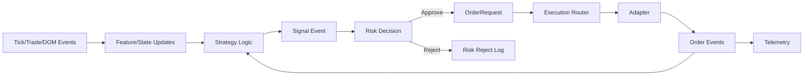

# STRATEGY_ENGINE.md — Estratégia Event-Driven

## Escopo
Definir estratégias orientadas a eventos consumindo `MarketEvent` e emitindo `Signal` para o pipeline de risco e execução.

## Base (`Strategy`)
- Subscrição: `tick`, `trade`, `dom_delta`, `dom_snapshot`.
- Estado: `SymbolState` (DOMState, DeltaBar, tape buffer).
- Método: `on_event(evt)`, `emit_signal(signal)`.
- Publicação: `signal` como `MarketEvent` (`event_type="signal"`).

## Exemplo: MicroPriceMomentumStrategy
- Lê mid-price (ou last) de eventos `tick`.
- Calcula delta vs. último mid; se ultrapassar limiar, emite sinal `buy`/`sell` com `score` e `confidence`.
- Features podem incluir médias móveis (`ml_features.py`: mean_5/mean_10/last).

## Contratos
- `Signal`: `signal_id`, `timestamp`, `symbol`, `direction`, `score`, `confidence`, `features`, `metadata`.
- `MarketEvent` de sinal: `event_type="signal"`, `source="strategy"`, payload serializado do `Signal`.

## Integração com Engines de Estado
- DOM: níveis e profundidade para sizing/posicionamento.
- Delta: desequilíbrio agressor/volume.
- Tape: ritmo de prints.
- Footprint: volume por preço/agressor para suportes/resistências micro.

## Diagrama — Fluxo de Sinal

## Testes e Qualidade
- Determinismo: estratégias não devem bloquear; callbacks devem ser idempotentes.
- Cobertura: testes de pipeline (strategy→risk→execution), replay para regressão.

## Extensões Futuras
- Biblioteca de sinais (pattern detector).
- ML inference: adicionar features e scoring em `Signal`.
