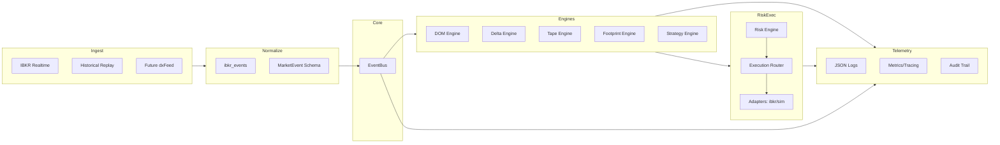

# SYSTEM_ARCHITECTURE.md — Arquitetura do Sistema

## Visão Macro
Plataforma event-driven com separação rígida de responsabilidades:
- **Ingestão**: IBKR (tick-by-tick, DOM, fallback L1) e Historical Replay.
- **Normalização**: `ibkr_events` converte callbacks em `MarketEvent` imutável.
- **Transporte**: `EventBus` thread-safe com subscrição por `event_type` e wildcard.
- **Engines de Estado**: DOM/Delta/Tape/Footprint para agregação e derivação de sinais.
- **Estratégia**: event-driven, consumindo eventos e emitindo `signal`.
- **Risco**: pré-trade determinístico, whitelists, limites e kill-switch.
- **Execução**: Router + adaptadores (sim/IBKR), ciclo de ACK/fill/reject.
- **Telemetria**: JSON logs, métricas/trace helpers, audit.
- **Configuração**: YAML base + perfis, overrides por ambiente.
- **Governança/Sec**: papéis, segredos, incidentes.

### Diagrama — Arquitetura Geral

## Domínios e Contratos
- **MarketEvent**: imutável, alias-friendly; carrega `event_type`, `timestamp`, `source`, `symbol`, `payload`.
- **EventBus**: publish/subscribe/stop; fila não bloqueante; worker seguro; wildcard `*`.

## Modos de Operação
- Sim (pipeline completo sem dependência externa).
- Live IBKR (TWS/IB Gateway).
- Replay (datasets CSV/JSON, pacing configurável).

## Observabilidade
- Logs estruturados, métricas/trace helpers, audit line.

## Configuração e Perfis
- `settings.yaml` + `profiles/{dev,paper,prod}.yaml` + env overrides.

## Governança
- Segredos externos, papéis distintos, kill-switch, auditoria de decisões e ordens.
