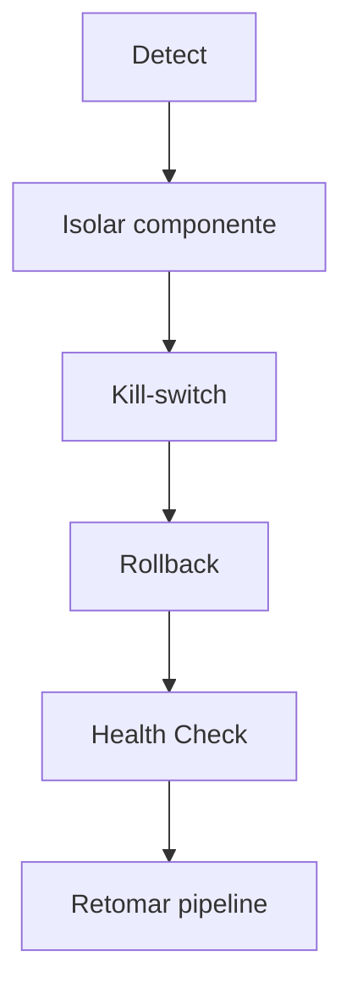

# Failure Recovery

## Categorias de Falha
- Feed stale (market data)
- Execução não responde
- Risco bloqueado
- Desalinhamento de config/secrets

## Mecanismos
- Watchdogs: detectam stale > threshold
- Kill-switch: cancela ordens via adaptadores
- Rollback: plano em `deployment.rollback`
- HealthStatus: expõe estado atual

## Fluxo de Recuperação

## Procedimento
1. Acionar watchdogs/alertas.
2. Disparar kill-switch se risco/execução comprometidos.
3. Reverter para artefato anterior.
4. Validar health/metrics.
5. Retomar operação.
