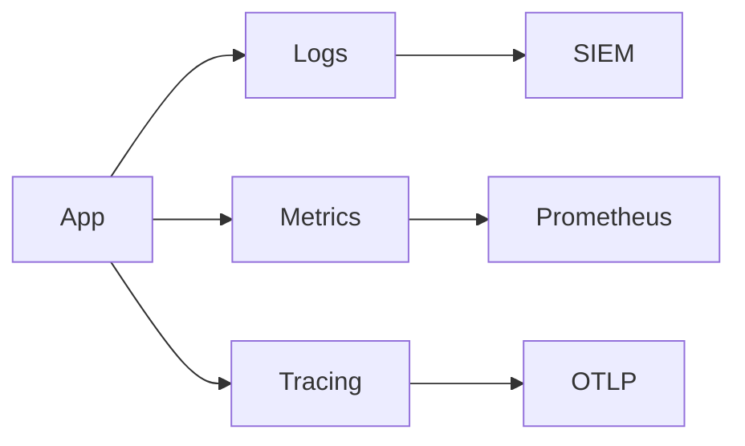

# Metrics and Tracing

## Logs
- JSON estruturado (ver `telemetry/logger.py`)
- Campos: ts, level, component, msg, trace_id/span_id

## Métricas
- Execução: slippage_bps_avg, latency_ms_avg, fills
- Observabilidade: watchdog stale count, health status
- Exportação Prometheus via `MetricsExporter.render_prometheus()`

## Tracing
- Wrapper `observability.tracing.span(name)`
- Trace correlation com `trace_id`/`span_id` no MarketEvent

## Diagrama

