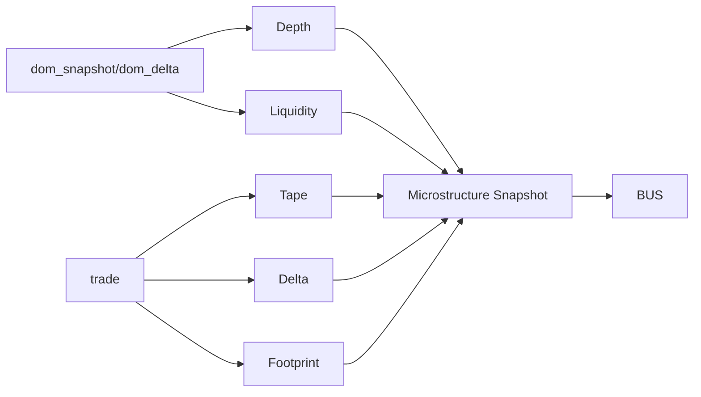

# Microstructure Engine

## Visão Geral
Motor avançado que agrega DOM, tape, delta, footprint e liquidez em um snapshot único (`microstructure`) para consumo da estratégia e ML.

## Componentes
- DepthEngine: desequilíbrio e posição em fila.
- AdvancedTapeEngine: agressor, absorção, histórico móvel.
- MicroDeltaEngine: delta comprador/vendedor + zero prints.
- FootprintEngineAdvanced: volume por preço e heatmap.
- LiquidityEngine: iceberg, spoof, replenishment e shifts.
- MicrostructureFeatureExtractor: flatten de features.

## Diagrama

## Evento
- `event_type`: `microstructure`
- `payload.snapshot`: estado completo + `features`

## Dados calculados
- mid/bid/ask/bid_size/ask_size
- imbalance, queue_position
- cumulative_delta, zero_prints
- absorption_score
- footprint per price (buy/sell)
- liquidity_signals {iceberg, spoof, replenishment, shift}

## Integração
- Subscrição automática ao EventBus via `MicrostructureEngine.start()`
- Produz snapshots em tempo real para StrategyOrchestrator
