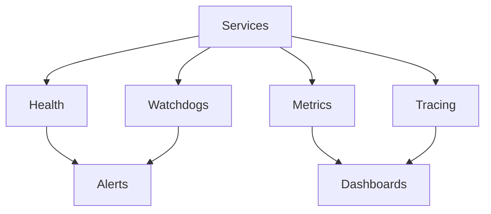

# Observability

## Objetivo
Fornecer visibilidade institucional com health, watchdogs, métricas e tracing distribuído.

## Componentes
- HealthStatus: snapshot de componentes.
- Watchdogs: detecção de feed stale e execução travada.
- MetricsExporter: Prometheus text.
- Tracing: spans OTLP-ready.

## Diagrama

## Integração
- Health/Watchdog alimentados pelo loop de orquestração
- MetricsExporter expõe string Prometheus
- Tracing wrapper `observability.tracing.span`

## Alertas
- Stale feed
- Execução sem eventos
- Risco não responde
