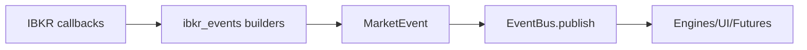

# PHASE_II.md — Bots Institucionais – Edição II — Camada de Provedores e Normalização

## 1) Propósito e Escopo
Expandir ingestão/normalização de mercado: suporte completo a IBKR (tick-by-tick, DOM, fallback L1), replays históricos determinísticos e base preparada para múltiplos provedores (dxFeed placeholder). Fortalecer compatibilidade de schemas e robustez do pipeline de dados.

## 2) Arquitetura de Referência (Fase II)
- **Provedores**: IBKR live; Historical Replay (CSV/JSON); dxFeed placeholder.
- **Normalização**: `ibkr_events` converte callbacks em `MarketEvent`.
- **Transporte**: `EventBus` permanece backbone.
- **Testes**: mocking IBKR, ordering de replay, aliases em `MarketEvent`.

### Diagrama — Pipeline de Normalização IBKR

## 3) IBKR: Tick-by-Tick, DOM, Fallback L1
- Conector IBKR:
  - Tenta tick-by-tick (BidAsk, AllLast).
  - Sempre DOM (`updateMktDepthL2`) para deltas de book.
  - Fallback para Level 1 (`tickPrice/tickSize`) se tick-by-tick falhar.
- Normalizadores (Pydantic imutáveis):
  - `NormalizedTick`, `NormalizedTrade`, `DOMDelta`, `DOMSnapshot`.
  - Builders: `build_from_ib_tick_by_tick_bid_ask`, `build_from_ib_tick_by_tick_all_last`, `build_dom_delta_from_l2`, `build_dom_snapshot`, `build_from_ib_l1_tick`.
- Campos derivados: mid, spread; agressor opcional; operação DOM (insert/update/delete).

## 4) Historical Replay
- `HistoricalLoader`:
  - CSV/JSON de eventos serializados; ordena por timestamp.
  - `replay(speed, on_event)` com pacing proporcional.
  - Callback opcional antes da publicação.
- Uso: regressões determinísticas, simulação de feed.

## 5) Compatibilidade de Schema
- `MarketEvent` aceita aliases (`type`, `ts`) e ignora extras.
- `payload` flexível para diferentes tipos de evento.
- Forward compatibility preservada.

## 6) Testes e Qualidade (Fase II)
- pytest:
  - Mock IBKR (instanciar conector sem rede).
  - Replay ordering/pacing.
  - Aliases e imutabilidade do `MarketEvent`.
- CHANGELOG v0.2.0 registra entregas de normalização e replay.

## 7) Operação (Fase II)
- IBKR: TWS/IB Gateway ativo; preferir tick-by-tick; fallback L1 automático.
- Replays: carregar datasets de teste em CSV/JSON e executar com `HistoricalLoader`.

## 8) Checklist de Conclusão (Fase II)
- [x] Normalização IBKR (tick/trade/DOM/L1 fallback).
- [x] Replay CSV/JSON com pacing configurável.
- [x] Contrato `MarketEvent` robusto a aliases.
- [x] Testes de mocking IBKR e replay.
- [x] Documentação e CHANGELOG atualizados (v0.2.0).
