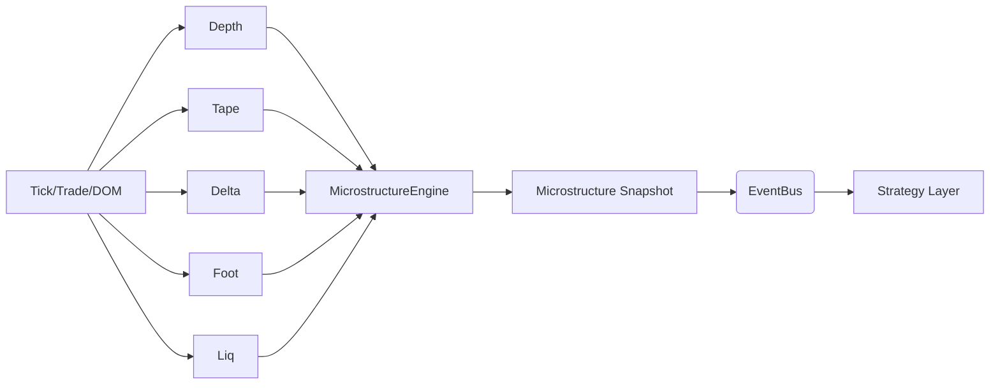

# Phase IV — Advanced Microstructure Engine

## Objetivo
Esta fase expande o núcleo de market data com engines de microestrutura que agregam profundidade, tape, delta, footprint e liquidez para produzir snapshots ricos e recursos para a estratégia institucional.

## Componentes
- DepthEngine: mapa de livro, desequilíbrio, posição em fila.
- AdvancedTapeEngine: reconstrução de negócios, agressor e absorção.
- MicroDeltaEngine: delta comprador/vendedor, CVD, zero prints.
- FootprintEngineAdvanced: volume por preço e heatmap de desequilíbrio.
- LiquidityEngine: iceberg, replenishment, spoof e shifts de liquidez.
- MicrostructureEngine: orquestrador que agrega e publica `microstructure`.
- MicrostructureFeatureExtractor: flatten de features para estratégia e ML.

## Fluxo de Dados

## Evento de Snapshot
- event_type: `microstructure`
- payload.snapshot: bid/ask, imbalance, delta, footprint, liquidez, features, tags

## Integração com EventBus
- Subscrições: `dom_snapshot`, `dom_delta`, `trade`, `tick`
- Publicação: `microstructure` com `features` pré-calculados

## Resiliência
- Estados por símbolo isolados
- Cálculos idempotentes e protegidos contra payloads vazios
- Feature extractor com defaults para ML/estratégia
