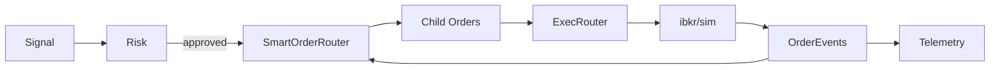

# Phase VI — Execução Avançada e Smart Routing

## Objetivo
Evoluir a execução para nível institucional com roteamento inteligente, slicing, controle de slippage, tempo em fila e ordens sintéticas.

## Componentes
- SmartOrderRouter: orquestra slicing, hints e delega ao ExecutionRouter.
- Child Slicing Engine: fatiamento por tamanho alvo.
- Queue-time Estimator: ETA baseado em posição relativa.
- Pegged/Synthetic Orders: ajustes de preço mid/iceberg.
- Cancel/Replace supervisionado.
- Exec Metrics: slippage e latência agregados.

## Fluxo de Execução

## Lógica de Roteamento
- Clip-size padrão configurável
- Metadata inclui ETA e hints
- Cancela/substitui via EventBus (`router_action`)

## Métricas
- slippage_bps_avg por símbolo
- latency_ms_avg por símbolo
- total fills

## Resiliência
- Fallback para ExecutionRouter base
- Cancel/replace em health degrade
