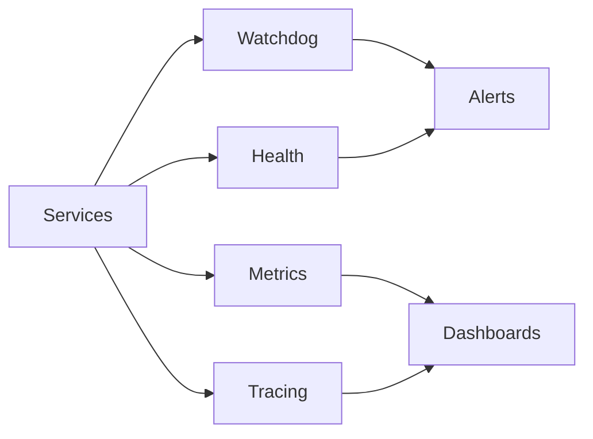

# Phase VII — Deployment, Observabilidade e Governança

## Objetivo
Estabelecer operação supervisionada com health checks, watchdogs, métricas, tracing, CI/CD e governança de configuração/secrets.

## Componentes
- HealthStatus + Watchdogs: detecção de feed stale, execução travada, risco quebrado.
- MetricsExporter: Prometheus text para slippage/latência/fills.
- Tracing: spans OTLP prontos para integração.
- Deployment: perfis dev/paper/prod, rollback scripts, CI/CD pipeline (GitHub Actions).
- Segurança: secrets por ambiente, perfis versionados.

## Fluxo de Observabilidade

## CI/CD
- Pipeline: lint → test → package → deploy
- Perfil de deploy selecionado por ambiente
- Rollback pronto com versão anterior

## Governança
- Perfis versionados em `config/profiles`
- Segredos fora do Git, exemplo em `secrets.example.yaml`
- Kill-switch automatizado via EventBus e adaptadores
