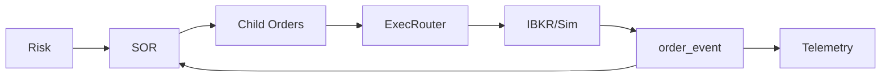

# Smart Routing

## Objetivo
Roteamento institucional com slicing, ETA de fila, peg orders e métricas de execução.

## Componentes
- SmartOrderRouter (SOR)
- Slicing Engine (`slice_order`)
- Queue-time Estimator
- Metrics (slippage/latência)
- Cancel/Replace supervisonado

## Fluxo

## Funcionalidades
- Clip-size configurável
- Metadata ETA por child order
- Peg mid/iceberg sintética
- Health superficial via `router_action`

## Métricas
- slippage_bps_avg, latency_ms_avg, fills
