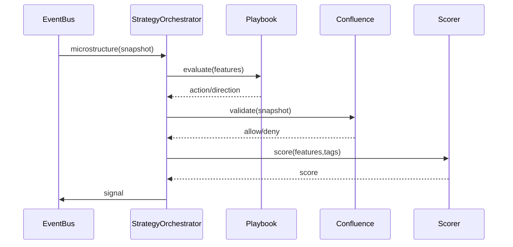

# Strategy Layer

## Objetivo
Transformar microestrutura e filtros de regime em sinais institucionais com playbooks e confluência.

## Módulos
- StrategyOrchestrator: loop principal, subscreve `microstructure`.
- PlaybookEngine: regras declarativas.
- ConfluenceFramework: filtros de spoof, regime, volatilidade.
- RegimeEngine: ATR/volume/sessão.
- SignalScorer: peso de features+tags.

## Fluxo

## Saída
- Evento `signal` com `direction`, `score`, `confidence`, `features`, `metadata.tags`

## Estados
- Cooldown por símbolo
- Regime gates para ambientes extremos
