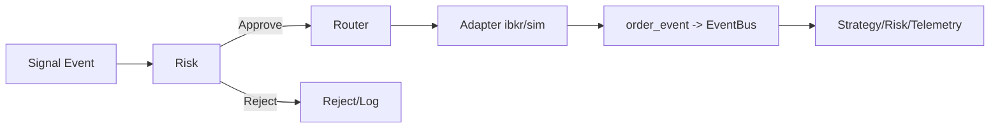

# EXECUTION_ENGINE.md — Roteamento e Adaptadores de Execução

## Escopo
Receber intenções de ordem aprovadas pelo risco, rotear para o adaptador correto (sim/IBKR), publicar eventos de ciclo de vida e manter o mapa de ordens.

## Componentes
- **ExecutionRouter**:
  - `submit(order)`: envia ao adaptador, armazena mapa, publica `order_event`.
  - `cancel(order_id)`, `replace(order_id, new_order)`.
  - Integração com EventBus para broadcast de `order_event`.
- **Adaptadores**:
  - `SimAdapter`: ACK imediato, fill com probabilidade configurável (default 100%), publica `order_event` (ack/fill/cancel).
  - `IBKRAdapter` (stub): constrói `Contract` FX e `Order` IBKR, envia via IB API, publica ACK local; callbacks publicam parciais/fills/rejects/cancels com `order_event`.
- **Modelos**:
  - `OrderRequest`: `order_id`, `symbol`, `side`, `quantity`, `order_type`, `limit_price`, `stop_price`, `tif`, flags (`post_only`, `reduce_only`, `dry_run`), `routing_hints`, `metadata`.
  - `OrderEvent`: `order_id`, `symbol`, `status` (`ack`, `partial_fill`, `fill`, `reject`, `cancel`, `error`), `timestamp`, `filled_qty`, `avg_price`, `reason`, `raw`.

## Fluxo
1) Estratégia gera `Signal`; risco converte em `OrderRequest` e aprova.
2) `ExecutionRouter.submit` envia ao adaptador.
3) Adaptador emite ACK/fill/reject/cancel como `order_event` no EventBus.
4) Estratégia/telemetria/risk pós-trade consomem `order_event`.

### Diagrama — Execução

## Tratamento de Falhas
- Sim: determinístico; sem falhas de transporte.
- IBKR: em erro, acionar kill-switch/cancel; evoluções futuras podem adicionar retry/backoff/rota alternativa.

## Telemetria
- Eventos de ordem publicados como `MarketEvent` (`event_type="order_event"`, `payload` com `OrderEvent`).
- Logs estruturados no adaptador/roteador; inclusão de `order_id`, `symbol`.

## Testes
- Pipeline strategy→risk→exec com sim adapter.
- Mock IBKR para instanciar sem rede.
