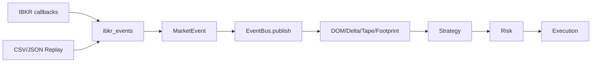

# MARKET_DATA_ENGINE.md — Engine de Dados de Mercado

## Escopo
Concentra ingestão, normalização e replay de dados de mercado, garantindo contrato estável (`MarketEvent`) e resiliência (fallback L1).

## Componentes
- **IBKR Connector**: subscrição a tick-by-tick (BidAsk, AllLast), DOM (`updateMktDepthL2`), fallback `reqMktData` (L1) se tick-by-tick falhar.
- **Normalizadores (`ibkr_events.py`)**:
  - `NormalizedTick`, `NormalizedTrade`, `DOMDelta`, `DOMSnapshot` (Pydantic imutáveis).
  - Builders: `build_from_ib_tick_by_tick_bid_ask`, `build_from_ib_tick_by_tick_all_last`, `build_dom_delta_from_l2`, `build_dom_snapshot`, `build_from_ib_l1_tick`.
  - Cálculo de mid/spread; agressor opcional; operações DOM (insert/update/delete).
- **Historical Replay** (`providers/historical_loader.py`):
  - Carrega CSV/JSON, ordena por timestamp, `replay(speed, on_event)` com pacing.
  - Callback opcional antes da publicação.
- **Contrato `MarketEvent`**:
  - Campos: `event_type`, `timestamp` UTC, `source`, `symbol`, `payload`, `trace_id`, `span_id`; aliases `type`/`ts`.
  - Config: imutável, `extra="ignore"`, `populate_by_name=True`.

## Fluxo de Dados

## Resiliência e Saúde
- Fallback L1 em falha de tick-by-tick.
- `IBKRHealth` (conceitual) para detectar feed stale (últimos tick/DOM).
- Shutdown: `EventBus.stop()` drena fila; conector IBKR encerra thread.

## Testes e Garantias
- Mock IBKR para instanciar sem rede.
- Replay determinístico (ordering e pacing).
- Validação de aliases e imutabilidade do `MarketEvent`.
