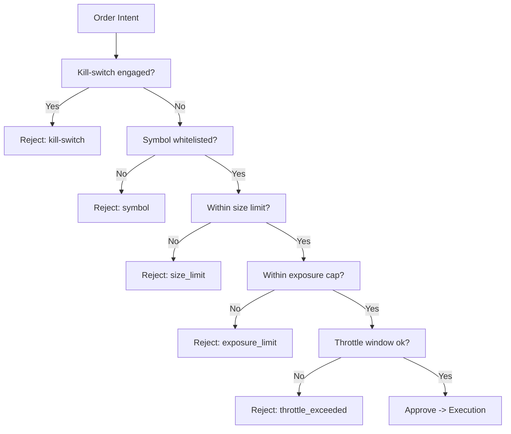

# RISK_ENGINE.md — Motor de Risco Pré-Trade

## Escopo
Avaliar intenções de ordem antes de envio, aplicando regras determinísticas e limites operacionais. Garantir bloqueio rápido em incidentes (kill-switch).

## Regras Implementadas
- **Kill-switch**: bloqueia qualquer ordem quando ativado.
- **Whitelist de símbolos**: apenas símbolos permitidos.
- **Limite de tamanho**: `max_size` por ordem.
- **Limite de exposição**: `max_exposure` acumulada por símbolo (buy aumenta, sell reduz).
- **Throttle**: máximo de ordens por janela de 60s (`throttle_max`) por símbolo.
- **Price collar** (helper conceitual): compara `limit_price` com preço de referência em bps.

## Contrato
- `RiskDecision`: `decision_id`, `timestamp`, `order_id`, `symbol`, `approved`, `reasons`, `limits`.

## Fluxo de Decisão

## Integração com Execução
- Risco é chamado antes de `ExecutionRouter.submit`.
- Decisão pode ser publicada como `risk_decision` no EventBus para telemetria/audit.

## Kill-switch
- Implementação em `risk/engine.py` (flag) e `risk/kill_switch.py` (notificação de listeners).
- Ação recomendada: acionar kill-switch, cancelar ordens ativas, registrar em audit.

## Testes
- Casos: rejeição por símbolo, tamanho, exposição, throttle, kill-switch.
- Verificar atualização de exposição quando aprovado.
